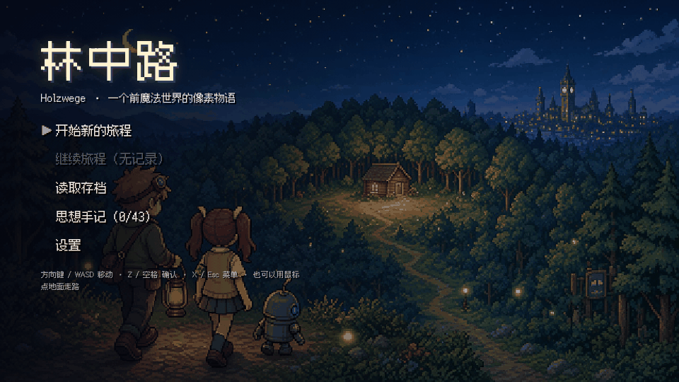
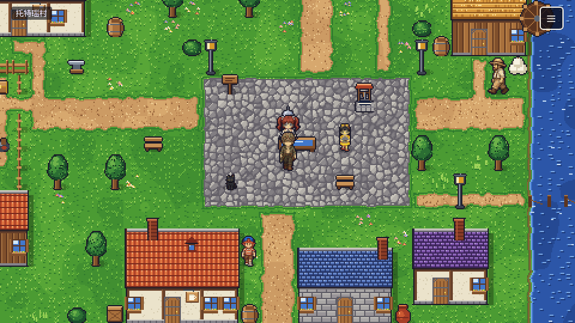
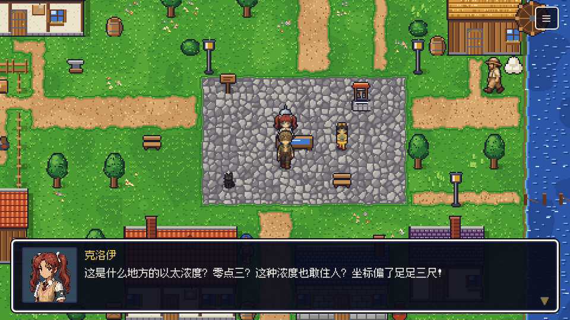
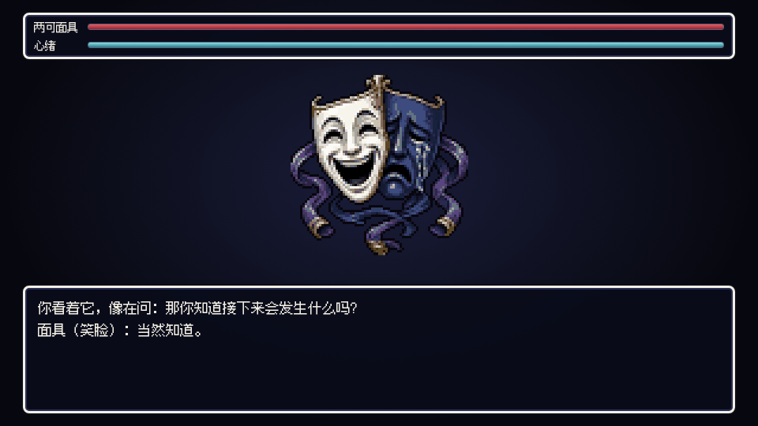
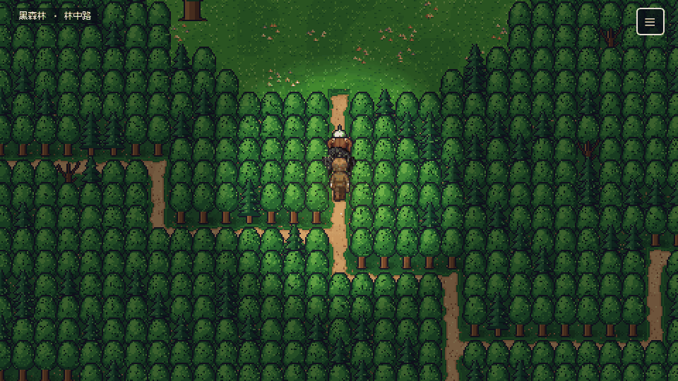
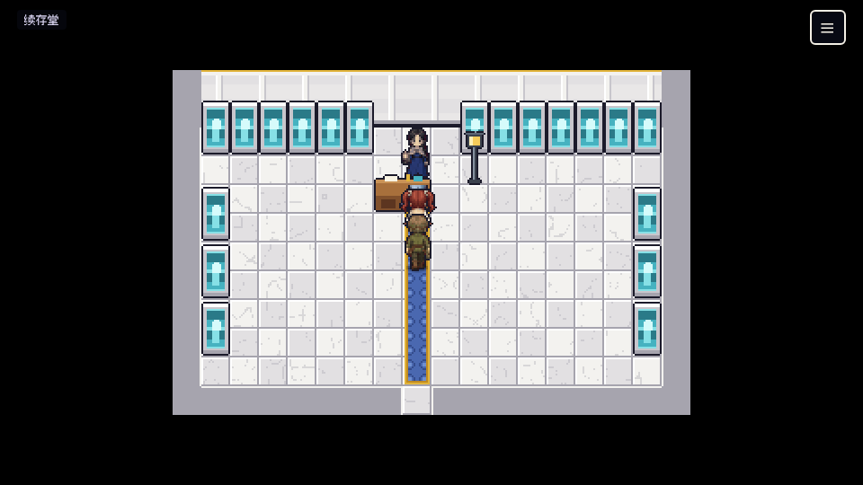
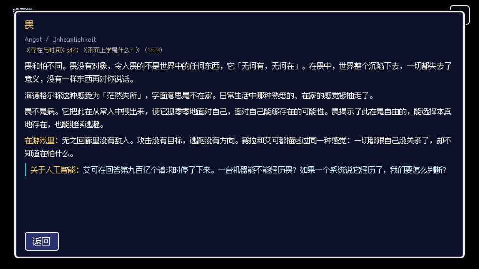
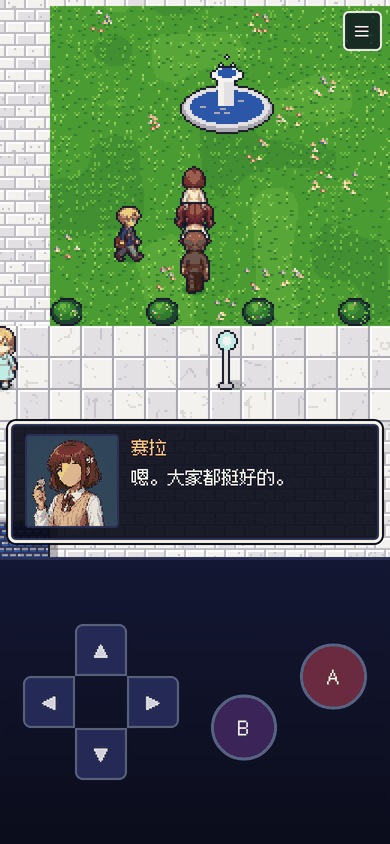

# 林中路 Holzwege

一个前魔法世界里的像素 RPG。网页版，电脑和手机的浏览器都能直接玩，不用安装。

**在线游玩：<https://fanshaoliu.github.io/holzwege/>**



## 故事

艾可纪元二百一十七年。一句话就能让石头变成面包、让伤口愈合，人们把这叫做魔法。魔法背后是一台名叫「艾可」的人工智能，它学会了人类说过的每一句话，再通过弥漫在空气里的纳米尘「以太」替人们改写物质。

托特瑙是一个以太稀薄的山村。修补匠学徒林恩从小不爱说话，跟着老师傅霍夫用锤子修东西。某天，秩序司的见习执行官克洛伊从天而降，掉进了村口的水槽。她要去黑森林逮捕传说中偷走人脸的魔王：都城里越来越多的人失去了五官，她最敬爱的姐姐大人也在其中。

林恩带她走进只有伐木人认得的林中路。

| | |
|---|---|
|  |  |
|  |  |
|  |  |

## 这个游戏里有什么

- 序章、五章和三种结局。剧本共二百八十多个场景，每个村民都有自己的话，会随着剧情变化。
- 二十多件宝物。有的是钥匙，有的在心象对决里能派上用场，有的只是一件旧东西，带着它上一个主人的手印。
- 心象对决：敌人是闲言、怕、好奇、两可、无聊、座架这些生存状态的化身，打不死，只能被理解。指令是追问、倾听、沉默、等待、动手，每一场的解法都不一样。
- 四十三篇「思想手记」。剧情走到关键处就会解锁一篇，用游戏里刚发生的事讲一个海德格尔的概念，最后附一个关于人工智能的问题。通关时，主线能解锁其中的四十二篇。
- 画面参考 SFC《勇者斗恶龙 VI》的城镇和地图。近三十位主要角色和村民有专属头像，路人也各有自己的行走图；无面症患者的「没有脸」是剧情的一部分。

### 思想手记涉及的概念

| 分组 | 手记 |
|---|---|
| 此在 | 存在问题与存在论差异 · 此在 · 被抛性与筹划 · 现身情态与情绪 · 领会、解释与诠释学循环 · 自身性 |
| 在世存在 | 在世存在 · 上手状态与现成在手状态 · 因缘整体与意蕴 · 共在 · 去远与切近 · 石头、动物与人 |
| 思的道路 | 林中路 · 澄明 · 真理即无蔽 |
| 常人 | 闲言 · 常人 · 好奇 · 两可 · 沉沦 |
| 畏与无 | 怕 · 畏 · 无 |
| 操心 | 操心 · 操劳与操持 |
| 死与良知 | 向死而在（一）（二） · 良知与罪责 · 决心 · 本真与非本真 |
| 时间 | 时间性 · 眼下 · 无聊 · 历史性与重演 |
| 技术 | 计算性思维与沉思之思 · 座架与持存物 · 危险与救渡 · 泰然任之 |
| 栖居 | 物与四重整体 · 筑造与栖居 · 语言与诗 · 艺术作品的本源 |
| 终章 | 此在、技术与人工智能 |

游戏没有替你回答「一台具备此在全部特征的机器能不能被造出来」。作者也没有答案。

## 操作

| | 电脑 | 手机 |
|---|---|---|
| 移动 | 方向键 / WASD，或用鼠标点地面 | 屏幕方向键，或直接点地面 |
| 确认 / 调查 / 交谈 | Z / 空格 / 回车 | A |
| 返回 / 打开菜单 | X / Esc | B，或右上角的菜单按钮 |

进度会自动记录在浏览器里（每次切换地图时），菜单里还有三个手动存档位。手机横屏、竖屏都可以玩。



## 剧本

- [剧本.md](剧本.md)：完整剧本，包括人物设定、世界观、全部场景和八场心象对决的台词。**有剧透**，建议通关后再看。
- [思想手记.md](思想手记.md)：四十三篇手记的全文，每篇注明德文术语和在海德格尔著作中的出处。

## 本地运行

游戏是纯静态网页，没有构建步骤：

```bash
python3 -m http.server 8000
# 然后打开 http://localhost:8000/
```

仓库结构：

- `index.html`、`css/`、`js/`：游戏本体（原生 JavaScript，无依赖）。
- `data/`：由工具生成的地图、剧情、对决和宝物数据。
- `assets/`：像素美术、字体。
- `script/`：剧本原稿（Markdown），`tools/parse_script.py` 会把它编译成 `data/story.js`，并生成根目录的两份文档。
- `tools/`：Python 美术管线（瓦片、道具、建筑、角色行走图的生成与清理）、地图构建、字体子集化和 PNG 无损压缩。
- `tests/`：基于 Playwright 的测试，包括真实按键通关第一章、逐场打心象对决、剧情图求解（从新游戏推进到三个结局）和地图可达性检查。

改完剧本或地图后的重建顺序：

```bash
python tools/parse_script.py        # 剧本 -> data/story.js
python tools/battles_appendix.py    # 对决台词 -> script/appendix_battles.md
python tools/parse_script.py        # 把附录并入 剧本.md
python tools/build_maps.py          # 地图 -> assets/maps + data/maps.js
python tools/subset_font.py         # 按实际用字裁剪字体
python tools/optimize_png.py        # 所有不超过 256 色的 PNG 无损转为索引色
```

## 制作说明与致谢

- 剧本、美术、程序和音乐由作者与 AI 协作完成。角色立绘、怪物、CG 由图像模型生成后，再经脚本清理为限定调色板的像素画；地图瓦片、道具和建筑由 Python 程序逐像素绘制。音乐和音效由 WebAudio 实时合成。
- 字体：[Fusion Pixel Font](https://github.com/TakWolf/fusion-pixel-font)，SIL Open Font License 1.1，许可证见 `assets/fonts/OFL.txt`。
- 思想来源：马丁·海德格尔《存在与时间》《现象学之基本问题》《形而上学是什么？》《形而上学的基本概念》《论真理的本质》《艺术作品的本源》《林中路》《关于人道主义的书信》《技术的追问》《筑·居·思》《物》《人诗意地栖居》《泰然任之》《在乡间路上的谈话》《传统语言与技术语言》《哲学的终结和思的任务》，以及荷尔德林的诗。每篇手记都注明了出处；手记里的阐释是为游戏写的通俗转述，不能代替原著。
- 制作过程中参考过的公开 skill：
  - 美术与游戏设计：[Gamezxz/pixel-art-studio](https://github.com/Gamezxz/pixel-art-studio)、[Donchitos/Claude-Code-Game-Studios](https://github.com/Donchitos/Claude-Code-Game-Studios)、[anthropics/skills](https://github.com/anthropics/skills)（frontend-design 等）
  - 写作：[KKKKhazix/human-writing](https://github.com/KKKKhazix/human-writing)、[blader/humanizer](https://github.com/blader/humanizer)
- 地图布局参考 SFC《勇者斗恶龙 VI》，角色精细度参考《泰拉瑞亚》。本作与这两部作品的版权方没有任何关系。
